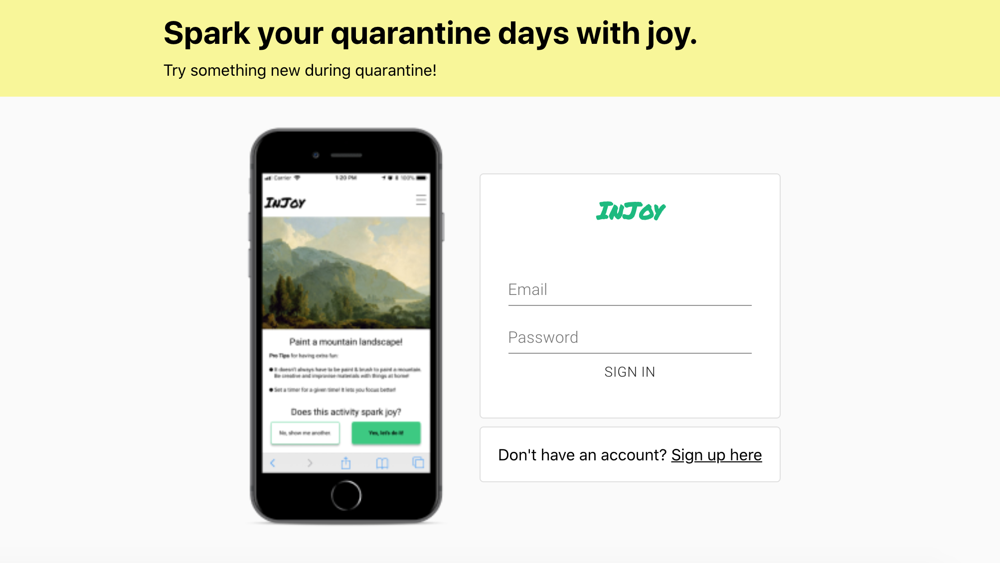
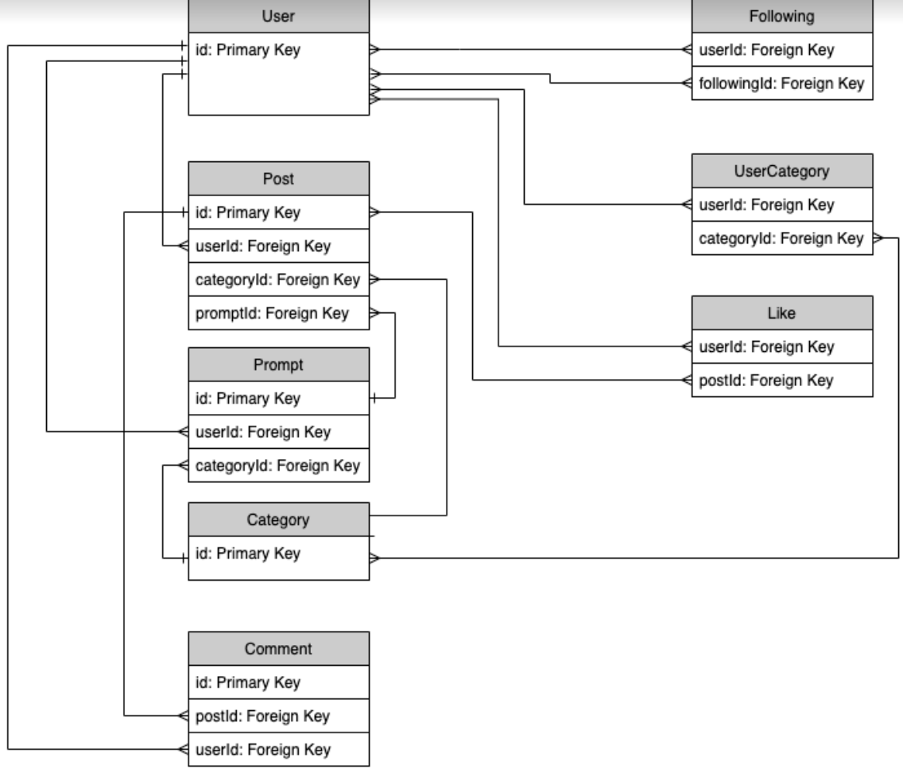
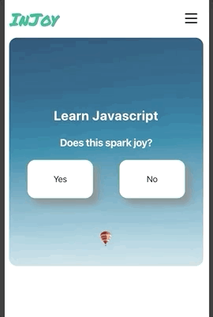

# InJoy

Web Application Project for [General Assembly's](https://generalassemb.ly/) internal 24 hour 'Sparks Joy' Hackathon. Working in a team of four, our decided direction was to create a mobile-first web application that provided users with a prompt for a fun task to complete and then upload a post about, from home. 

Our team has been working to expand this project into a fully functioning, full stack web app with the following tech stack:

- React.js
- GraphQL
- Express.js
- PostGreSQL (Sequelize)

# Setup
1. npm install inside of the `/client` folder
2. npm install inside of the `/server` folder
3. run `npm start` inside of the `/client` folder
4. run `npx nodemon app.js` or just `nodemon app.js` inside the `server` folder
5. All done!

# Team
We worked in a team of four made up of two User Experience Designers and two Developers.  
[Signe Bergman - UX Designer](https://www.linkedin.com/in/signebergman/)  
[Jay-Kwon James Park - UX Designer](https://www.linkedin.com/in/jaykwonjpark/)  
[Erik Heikkila - Full Stack Web Developer](https://www.linkedin.com/in/erik-hei/)  
[Melissa Young - Front End Developer](https://www.linkedin.com/in/melissadcyoung/)  

# Project Architecture

## Schema

## GraphQL Queries and Mutations

### Queries 

|Function Name| Behavior|
|------|-----|
|`currentUser`| Returns current user|
|`user(id: Int!)`|Returns a single user|
|`post(id: Int!)`| Returns a single post|
|`posts`| Returns all posts|
|`prompt(id: Int!)`| Returns a single prompt|
|`prompts`| Returns all prompts|
|`randomPrompt`| Returns a random prompt|
|`category(id: Int!)`| Returns a single category|
|`categories`| Returns all categories|

### Mutations

|Function Name| Behavior|
|------|-----|
|`signup`|Creates an entry in the user table and gives back a valid session token|
|`login`|Locates and validates an existing user and gives back a valid session token|
|`followUser`|Creates an entry in the follow table with the current user id and the user id passed in|
|`unfollowUser`|Removes an entry in the follow table with the current users id and the user id passed in|
|`editCurrentUser`|Locates and updates current user’s information based on what’s passed in|
|`editCurrentUserPassword`|Locates and updates current user’s password if a valid password is also given. Gives back an updated session token.|
|`deleteCurrentUser`| Removes current user from users table|
|`addCategoryToUser`| Adds an entry to the usercategory table with the current user’s id and the passed in category id.|
|`removeCategoryFromUser`| Removes an entry from the usercategory table with the current user’s id and the passed in category id |
|`createPrompt`| Creates and adds a new entry to the prompts table|
|`editPrompt`| Updates an entry in the prompt table as long as no posts have been assigned to it. Based on id passed in|
|`deletePrompt`| Removes an entry from the prompt table as long as no posts have been assigned to it. Based on id passed in.|
|`createPost`| Creates and add a new entry to the post table, or updates non published entry with new prompt id |
|`publishPost`| Updates latest non published entry with post information and publishes it|
|`editPost`| Updates the text of an entry in the post table. The picture is not updatable. |
|`deletePost`| Removes an entry from the post table.|
|`addLikeToPost`| Creates an entry in the like table using the current user id and post id |
|`removeLikeFromPost`| Removes an entry from the like table|
|`createComment`| Creates an entry in the comment table|
|`editComment`| Updates an entry in the comment table|
|`deleteComment`| Removes an entry from the comment table|

## Site Map

## Wireframes

Wireframes are hosted on [Figma](https://www.figma.com/file/UNfAe2JLJ5tJBiPRrwsDZu/Final-Designs?node-id=1%3A17). Request access from the team to view wireframes. 

# Hackathon Research
- Created and sent out a quick 5 question survey to help figure out audience, age, interests, and what people have readily available at home in terms of hobby/activity related items. Also included open ended questions about activities or skills people wanted to try out or develop, but just hadn't gotten around to yet.
- Competetive analysis with similar social applications such as Instagram, Tinder, and Bumble.
- Created a user journey map

# Hackathon MVP:
1. Have a sign up and login flow
2. Have user's able to select a prompt
3. Have user able to post about the prompt

# Accomplished Goals:

### 1. Hackathon
1. User's were able to sign up for a new account, though for the hackathon, we saved all credentials to a JSON file in plain text and also did not persist the session.
2. Since we did save credentials to the file, users were able to log back in after signing up.
3. Prompts were provided for a user to choose from, one at a time, so user's could either decide if that prompt interested them or not. If not, a new prompt replaced the previous one. Currently, all prompts are sourced from the [Bored API](https://www.boredapi.com/), so while we do have quite a few of them, they are not all prompts that can be accomplished while remaining at home.
4. User's were able to select a prompt and then post about it. Currently you can supply the app with a title, a description, and a link to an image. After submitting a post, that post then displays on the feed.

### 2. Development
1. Implemented Sequelize as ORM.
2. Backend API is built and fully tested in GraphQL, including CRUD routes for Users, Prompts, Categories, Posts, and Comments.
3. Implemented [Cloudinary](https://cloudinary.com/) widget, allowing users to upload photos for posts.
4. Implemented auth on React front end so users can register and login through the user interface.

# Current Product Images  
   

 

# Future Goals
- Conduct more user research through an additional survey to gain a deeper insight into what features in a social application are most pertinant to a user.
- Conduct more competative analysis of different platforms and what they offer that users like.

# Improvements Going Forward
- Complete user research to see what social features users would find the most beneficial in our application.
- Develop mobile-first approach into responsive frontend for both mobile and desktop.

